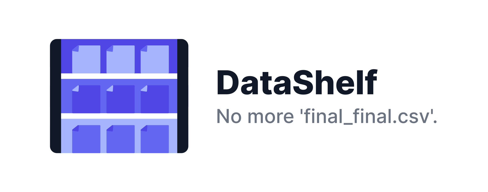

# DataShelf



DataShelf is a lightweight version control system for datasets.

It helps analysts and data scientists manage evolving versions of their data—right from Python or the command line—without needing to track CSVs or Parquet files manually. It’s especially useful for iterative workflows involving EDA, feature engineering, or model development.

## Key Features

- Track changes to datasets across time using hashes, tags, and messages
- Restore any prior version of a dataset, even after overwrites
- Group datasets into named collections for clean project structure
- Use simple CLI and Python commands to inspect, save, or retrieve files
- Avoid duplication, overwrite mistakes, or unclear file names

## Quick Example

```python
import datashelf.core as ds

ds.init()  # Creates .datashelf/ in your working directory

ds.save("data/raw_sales.csv", collection="Sales Q4", tag="raw", message="Initial export")
ds.save("data/cleaned_sales.csv", collection="Sales Q4", tag="cleaned", message="Nulls removed")

# Checkout a prior version
ds.checkout("Sales Q4", hash="abc123", output_path="restored.csv")
````

Or via CLI:

```bash
# Init and create collection
datashelf init
datashelf create_collection "Sales Q4"

# Save data using python API
...

# Display collection files in a table
datashelf ls coll-files

# Checkout data
datashelf checkout <collection_name> <hash>
```

## Concepts

* **Collections**: Logical groups of datasets, usually tied to a single analysis or project
* **Tags**: Labels like `raw`, `cleaned`, `final` that describe dataset state
* **Messages**: Optional commit-style messages saved alongside each version
* **Hashes**: Unique identifiers used to retrieve exact versions
* **Snapshots**: Project-wide point-in-time saves of all collections

For example, you might have separate collections for:

* `Sales Forecasting Q4`
* `People Analytics Q4`
* `Customer Feedback Analysis`

Each collection tracks its own datasets independently.

## Installation

```bash
pip install datashelf
```

Requires Python 3.8+


## Documentation

* [Getting Started (5 min)](docs/getting-started.md)
* [Advanced Usage](docs/advanced-usage.md)
* [CLI Reference](docs/cli-reference.md)
* [Troubleshooting](docs/troubleshooting.md)

## Contributing

Issues, suggestions, and PRs welcome. If you'd like to get involved or have feedback, open an issue or submit a pull request.

## Changelog

See [CHANGELOG.md](CHANGELOG.md) for version history and release notes.

## License

This project is licensed under the MIT License. See [LICENSE](./LICENSE) for details.


