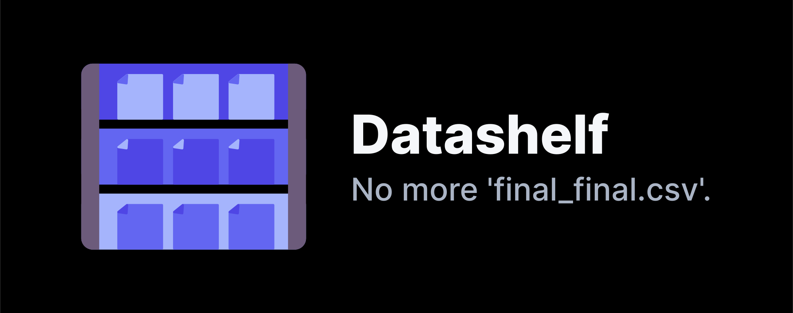

# Datashelf

**Lightweight local dataset tracking for data science projects.**



Stop naming files `data_final_really_final.csv`. Datashelf stores tabular datasets as immutable artifacts and lets you retrieve them by name or hash — so your experiments stay reproducible without any heavy infrastructure.

```bash
$ datashelf save data/people.csv people_raw --message "initial load" --tag raw
Successfully saved 'people_raw' (hash: c8a2f8e1)

$ datashelf load people_raw --df
# Returns a pandas DataFrame, ready to use
```

---

## Why Datashelf?

Data science projects often accumulates files like this:

```
data.csv
data_clean.csv
data_final_v2.csv
data_final_really_final.csv
```

Datashelf replaces that chaos with **content-addressed storage**: each dataset is hashed (SHA256), stored once as Parquet, and registered with metadata; and if you try to save a duplicate, Datashelf tells you. You can always get your data back by name or hash prefix. 

---

## Installation

```bash
pip install git+https://github.com/r0hankrishnan/datashelf.git
```

> PyPI release coming soon.

---

## Quick Start

```bash
# Initialize in your project directory
datashelf init

# Save a dataset
datashelf save data/people.csv people_raw --message "initial load" --tag raw

# List what's stored
datashelf list

# Load it back into pandas
datashelf load people_raw --df
```

Or use the Python API:

```python
import datashelf as ds

ds.init()
ds.save("data/people.csv", name="people_raw", message="initial load", tag="raw")
df = ds.load("people_raw", to_df=True)
```

---

## Commands

| Command | Description |
|---|---|
| `datashelf init` | Initialize a `.datashelf/` repo in the current directory (recommended to intialize in your project's root) |
| `datashelf save <path> <name>` | Store a dataset artifact |
| `datashelf list` | List all stored datasets |
| `datashelf show <name>` | Inspect metadata for a dataset |
| `datashelf load <name>` | Print the artifact path (use `--df` to load into pandas) |
| `datashelf checkout <name> <dest>` | Export an artifact to another location |

---

## How It Works

When you save a dataset, Datashelf:

1. Computes a SHA256 hash of the file contents
2. Normalizes it to Parquet and stores it at `.datashelf/artifacts/<hash>.parquet`
3. Registers metadata (name, tag, message, timestamp) in `.datashelf/metadata.json`

If you try to save the same data again under a different name, Datashelf detects the duplicate and asks if you want to update the metadata instead of storing a redundant copy.

```
.datashelf/
├── config.yaml
├── metadata.json
└── artifacts/
    └── c8a2f8e1...parquet
```

---

## Design Philosophy
Datashelf deliberately tracks only tabular data. The core of the tool is duplicate detection and easy data organization: before storing anything, Datashelf checks whether you've already saved that data under a different name. For that check to work reliably, every dataset needs to be in a canonical format — you can't meaningfully compare a CSV and a Parquet of the same table without normalizing them first. I chose Parquet as the canoncial format for its size benefits.

Accepting only tabular data is the direct consequence of that decision. It also makes future features like dataset diffing coherent — diffing only makes sense when you can compare rows and columns. Trying to extend Datashelf to handle images, audio, or arbitrary binary files would undermine both of those things without adding much value over a general-purpose tool like DVC.

The scope is intentionally narrow: Datashelf does one thing well for one kind of data.

---

## Comparison

| Tool | Best for |
|---|---|
| **Datashelf** | Lightweight local dataset tracking on a single project |
| DVC | Full data version control with remote storage and pipeline orchestration |
| Git LFS | Large file versioning inside a Git repository |

Datashelf intentionally has no Git integration, no remote storage, and no pipeline orchestration. It's small and it stays out of your way.

---

## Supported File Types

Datashelf accepts `.csv`, `.parquet`, `.xlsx`, and `.json` files and normalizes everything to Parquet internally.

---

## Running Tests

```bash
pytest
```

---

## Roadmap

- [ ] PyPI release
- [ ] Dataset diffing
- [ ] Experiment tracking
- [ ] Dataset lineage
- [ ] Remote artifact storage

---

## License

MIT — see [LICENSE](./LICENSE).

---

## Contributing

See [CONTRIBUTING.md](./CONTRIBUTING.md).
